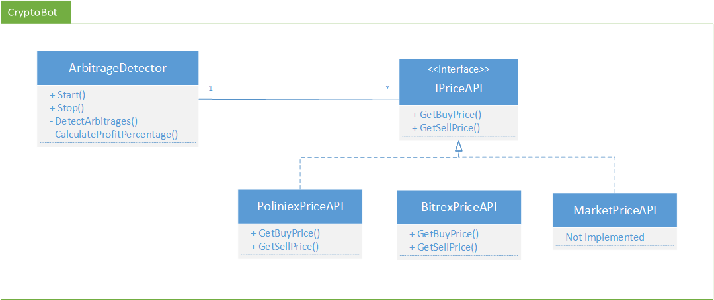

# CryptoBot
CryptoBot that can detect arbitrages and use them to make profit.

### TODO
- Bitrex API implementeren
- Poliniex API implementeren
- Berekening toevoegen in de ArbitrageDetector.cs + Unittest
- Frontend toevoegen zodat simulatie inzichtelijk wordt
- Docker configureren
- Uitrollen

### Deploy
- Docker

#### Literature
- https://steemit.com/arbitrage/@kesor/the-math-behind-cross-exchange-arbitrage-trading
- https://steemit.com/cryptocurrency/@scrawl/a-brief-look-at-crypto-arbitrage-trading