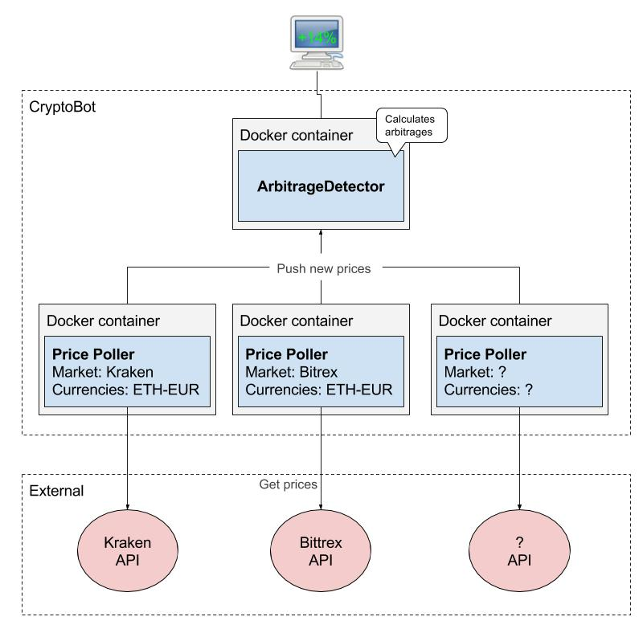

# CryptoBot
CryptoBot that can detect arbitrages and use them to make profit.

### Currently supported markets
- GDAX
- Coinbase
- Bittrex
- Kraken

### Run & Deploy
#### prerequisites
- Visual Studio 2017 (For development)
- .NET Core 2.0 (For development)
- Docker (with docker-compose)

#### For local development:
1. Clone this repository
2. Run the PricePoller project without debugging in Visual Studio. The example configuration is available in appsettings.json
3. Run the ArbitrageDetector project. Prices from the pricepoller should be picked up by the ArbitrageDetector.

#### For production:
1. Clone this repository in your production environment
2. Configure the markets and currencies of your choice (note the supported markets). Example configuration is available in docker-compose.yml.
3. Run `docker-compose up` in the root directory to build and start the docker containers.
4. Everything should be working.

#### Literature
- https://bitcoin.stackexchange.com/questions/49819/cryptocurrency-arbitrage-what-do-i-need-to-know
- https://steemit.com/arbitrage/@kesor/the-math-behind-cross-exchange-arbitrage-trading
- https://steemit.com/cryptocurrency/@scrawl/a-brief-look-at-crypto-arbitrage-trading

### TODO
- Implement ArbitrageDetector
- Add frontend to show calculated arbitrages
- Implement Fees from markets into arbitrage calculation.