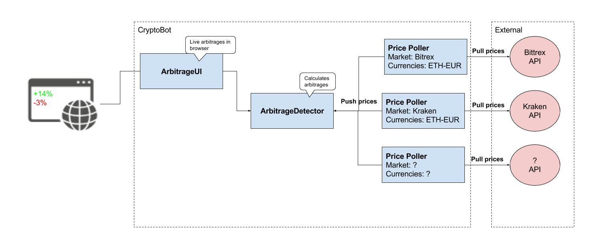

# CryptoBot
CryptoBot that can detect arbitrages and use them to make profit.

### TODO
- Implement abstract price poller 
- Configure Poliniex API
- Configure Bitrex API
- Implement ArbitrageDetector
- Add frontend to show calculated arbitrages
- Configure docker

### Deploy
- Docker

#### Literature
- https://steemit.com/arbitrage/@kesor/the-math-behind-cross-exchange-arbitrage-trading
- https://steemit.com/cryptocurrency/@scrawl/a-brief-look-at-crypto-arbitrage-trading